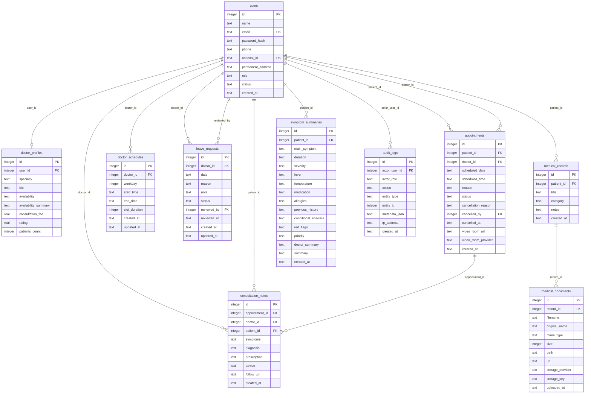

# Database ERD - MediConnect

This document describes the main database structure of the Telehealth Consultation and Medical Record Management System. The schema is implemented in `server/src/db/schema.js`. SQLite is the default local development database, while PostgreSQL support is available through the PostgreSQL-ready schema and `DB_CLIENT=postgres`.

## Entity Relationship Diagram

**Figure 4.3 - MediConnect Database Entity Relationship Diagram**

This ERD shows the central entities and their foreign key relationships. The `users` table stores all patient, doctor, and admin accounts. Doctor-specific profile data is stored in `doctor_profiles`, while appointments connect patient users and doctor users through `patient_id` and `doctor_id`. Medical records and documents are separated so that one record may contain multiple uploaded files. Consultation notes are linked to appointments and to both doctor and patient users. Audit logs are associated with the actor user when available.

**Purpose:** This diagram should be used in the database design chapter to explain how authentication, appointments, medical records, consultations, schedules, leave requests, and audit tracking are persisted.

## Relationship Notes

- `appointments.patient_id` references `users.id` for the patient account.
- `appointments.doctor_id` references `users.id` for the doctor account. The doctor profile is connected through `doctor_profiles.user_id`.
- `doctor_schedules.doctor_id` and `leave_requests.doctor_id` reference doctor users in `users`.
- `consultation_notes.appointment_id` connects a note to the appointment workflow.
- `medical_documents.record_id` connects uploaded files to their medical record container.
- `audit_logs.actor_user_id` is nullable to support anonymous or failed-login audit events.

## PostgreSQL Readiness

The SQLite schema uses `INTEGER PRIMARY KEY AUTOINCREMENT` and text-based timestamps for local development. The PostgreSQL schema maps these concepts to `BIGSERIAL`, `DATE`, `TIME`, `TIMESTAMPTZ`, and `JSONB` where appropriate. This preserves the same logical relationships while supporting a production-ready database backend.
