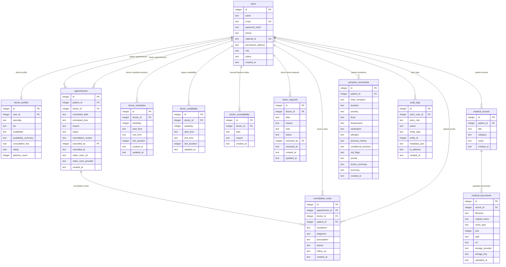

# Database ERD - MediConnect

Tài liệu này mô tả cấu trúc database của dự án MediConnect. SQLite là mặc định cho local development, PostgreSQL là backend optional cho production.

Schema chính:

```text
server/src/db/schema.js
```

Seed demo data:

```text
server/src/db/seed.js
```

## 1. ERD overview



## 2. Bảng và vai trò

### `users`

Lưu toàn bộ tài khoản trong hệ thống.

Vai trò:
- `patient`
- `doctor`
- `admin`

Trạng thái:
- `ACTIVE`
- `INACTIVE`
- `DELETED`

Ghi chú:
- `email` là unique.
- `national_id` là unique cho patient registration.
- `password_hash` được lưu trong database nhưng không trả về API.

### `doctor_profiles`

Lưu thông tin chuyên môn của bác sĩ:
- Specialty
- Bio
- Availability summary
- Consultation fee
- Rating
- Patients count

Quan hệ:
- `doctor_profiles.user_id` references `users.id`.
- Một doctor user có một profile.

### `appointments`

Lưu lịch hẹn giữa bệnh nhân và bác sĩ.

Status:
- `PENDING`
- `CONFIRMED`
- `COMPLETED`
- `CANCELLED`

Business rules:
- `PENDING`, `CONFIRMED`, `COMPLETED` lock slot.
- `CANCELLED` release slot.
- Pending cũ hơn 30 phút tự hết hạn.
- Duplicate booking trong 5 giây trả appointment cũ.
- Khi appointment chuyển sang `CONFIRMED`, backend tạo Jitsi `video_room_url` nếu chưa có.
- Video room chỉ cho assigned patient/doctor truy cập trong khung 15 phút trước giờ hẹn đến lúc appointment kết thúc.

### `doctor_schedules`

Lưu lịch làm việc có cấu trúc:
- `weekday`: 0 đến 6.
- `start_time`: `HH:mm`.
- `end_time`: `HH:mm`.
- `slot_duration`: số phút mỗi slot.

Business rules:
- Một ngày có thể có nhiều session.
- Không cho overlap session.
- End time phải sau start time.

### `doctor_availability`

Bảng availability cũ, giữ lại để tương thích. Workflow mới dùng `doctor_schedules`.

### `doctor_unavailability`

Lưu ngày không làm việc thủ công của bác sĩ.

### `leave_requests`

Lưu workflow bác sĩ xin nghỉ:
- Doctor gửi request với date, reason, note.
- Admin approve hoặc reject.
- Chỉ request `APPROVED` mới block booking slot.

### `medical_records`

Container hồ sơ y tế do patient tạo.

Permissions:
- Patient tạo và xóa hồ sơ của mình.
- Doctor chỉ xem hồ sơ nếu có appointment với patient.

### `medical_documents`

Lưu metadata file upload:
- Tên file đã lưu.
- Tên file gốc.
- MIME type.
- Size.
- Local path.
- Public URL path.
- Storage provider: `local` hoặc `firebase`.
- Storage key: local file path hoặc Firebase object key.

Security:
- Chỉ nhận PDF, JPG, PNG.
- Giới hạn 10MB.
- Chặn extension nguy hiểm như `.exe`, `.sh`, `.bat`, `.js`.

### `symptom_summaries`

Lưu dữ liệu chatbot:
- Main symptom
- Duration
- Fever
- Medication
- Allergies
- Previous history
- Conditional answers
- Red flags
- Priority
- Doctor-facing summary

Ghi chú:
- Chatbot không chẩn đoán.
- Chatbot không kê đơn.
- Red flags chỉ dùng để đánh dấu priority `HIGH`.

### `consultation_notes`

Lưu kết quả tư vấn của bác sĩ cho appointment.

Fields chính:
- `appointment_id`
- `doctor_id`
- `patient_id`
- `symptoms`
- `diagnosis`
- `prescription`
- `advice`
- `follow_up`

Business rules:
- Doctor chỉ tạo note cho appointment được phân công.
- Sau khi tạo note, appointment chuyển thành `COMPLETED`.
- Patient chỉ xem consultation notes của mình.

### `audit_logs`

Lưu nhật ký hành động quan trọng trong hệ thống.

Fields chính:
- `actor_user_id`: user thực hiện hành động, nullable cho anonymous/login failure.
- `actor_role`: `admin`, `doctor`, `patient` hoặc `anonymous`.
- `action`: loại hành động, ví dụ `auth.login.success`, `appointment.created`, `medical_record.uploaded`.
- `entity_type`, `entity_id`: đối tượng bị tác động.
- `metadata_json`: metadata đã được sanitize, không lưu password hoặc raw file content.
- `ip_address`: địa chỉ IP nếu có.

Use cases:
- Trace login success/failure.
- Theo dõi thay đổi doctor account.
- Theo dõi appointment cancellation.
- Theo dõi upload/delete medical file.
- Theo dõi leave approval và consultation note creation.

## 3. Relationship summary

User to doctor profile:
- `users.id` -> `doctor_profiles.user_id`
- One-to-one.

Patient to appointment:
- `users.id` -> `appointments.patient_id`
- One-to-many.

Doctor to appointment:
- `users.id` -> `appointments.doctor_id`
- One-to-many.

Doctor to schedule:
- `users.id` -> `doctor_schedules.doctor_id`
- One-to-many.

Doctor to leave requests:
- `users.id` -> `leave_requests.doctor_id`
- One-to-many.

Patient to medical records:
- `users.id` -> `medical_records.patient_id`
- One-to-many.

Medical record to documents:
- `medical_records.id` -> `medical_documents.record_id`
- One-to-many.

Patient to symptoms:
- `users.id` -> `symptom_summaries.patient_id`
- One-to-many.

Appointment to consultation notes:
- `appointments.id` -> `consultation_notes.appointment_id`
- One-to-many.

User to audit logs:
- `users.id` -> `audit_logs.actor_user_id`
- One-to-many, nullable cho anonymous events.

## 4. Authorization theo quan hệ dữ liệu

Patient:
- Chỉ truy cập appointments, records, symptoms và consultations có `patient_id = req.user.id`.

Doctor:
- Chỉ truy cập appointments có `doctor_id = req.user.id`.
- Chỉ xem patient detail và records nếu có appointment chưa cancel với patient đó.
- Chỉ quản lý schedule và leave requests của chính mình.

Admin:
- Xem system summary, users, doctors, appointments.
- Tạo/sửa/deactivate/reactivate/delete doctors.
- Approve/reject leave requests.

## 5. Data lifecycle examples

Appointment booking:
1. Patient gọi `POST /appointments`.
2. Backend kiểm tra doctor active.
3. Backend gọi `generateSlots(date, doctorId)`.
4. Backend reject nếu slot không tồn tại hoặc đã bị lock.
5. Backend insert appointment `PENDING`.
6. Slot không còn available ngay lập tức.

Video consultation:
1. Doctor/admin confirm appointment bằng `PATCH /appointments/:id/status`.
2. Backend lưu `video_room_provider = jitsi` và `video_room_url = https://meet.jit.si/mediconnect-appointment-{appointmentId}` nếu chưa có.
3. Assigned patient/doctor gọi `GET /appointments/:id/video-room`.
4. Backend kiểm tra JWT, ownership, status `CONFIRMED` và access window.
5. Frontend mở Jitsi room trong tab mới, không chuyển khỏi dashboard.

Leave request:
1. Doctor gọi `POST /leave-requests`.
2. Row được tạo với `PENDING`.
3. Admin gọi approve hoặc reject endpoint.
4. Nếu approved, `generateSlots` không trả slot cho doctor/date đó.

Medical upload:
1. Patient tạo row trong `medical_records`.
2. Patient upload file vào `POST /records/:id/upload`.
3. Multer lưu file local.
4. `medical_documents` lưu metadata và URL.
5. Doctor xem được file nếu được phân công với patient.

Consultation:
1. Doctor mở appointment.
2. Doctor post consultation note.
3. Backend insert `consultation_notes`.
4. Backend mark appointment `COMPLETED`.
5. Patient xem kết quả ở `/patient/result`.
