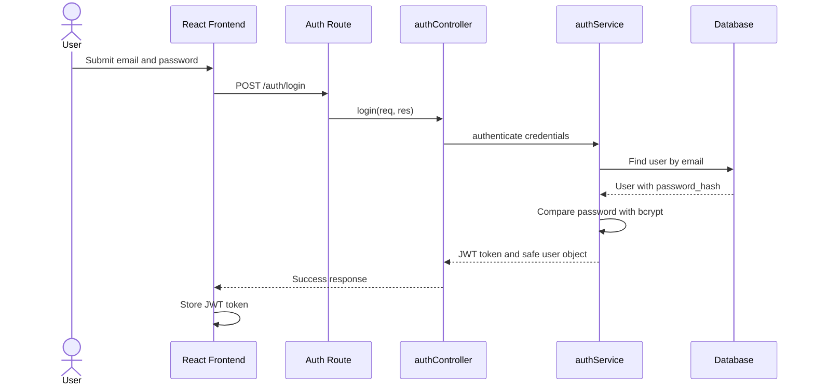
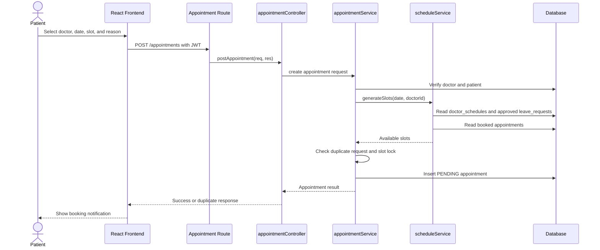
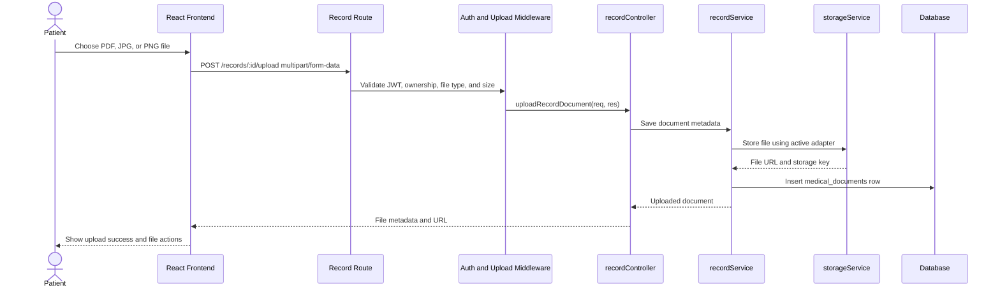
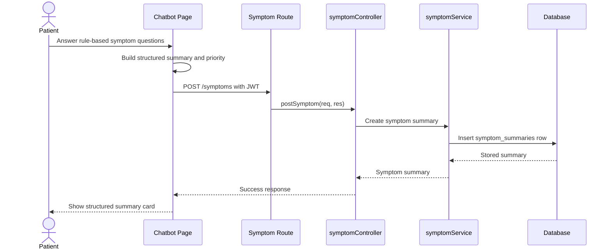
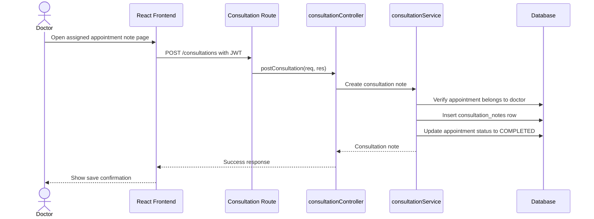
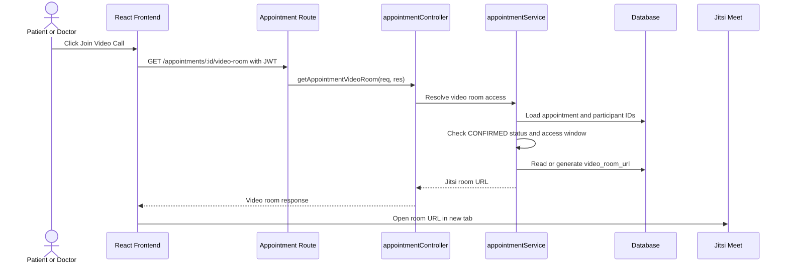
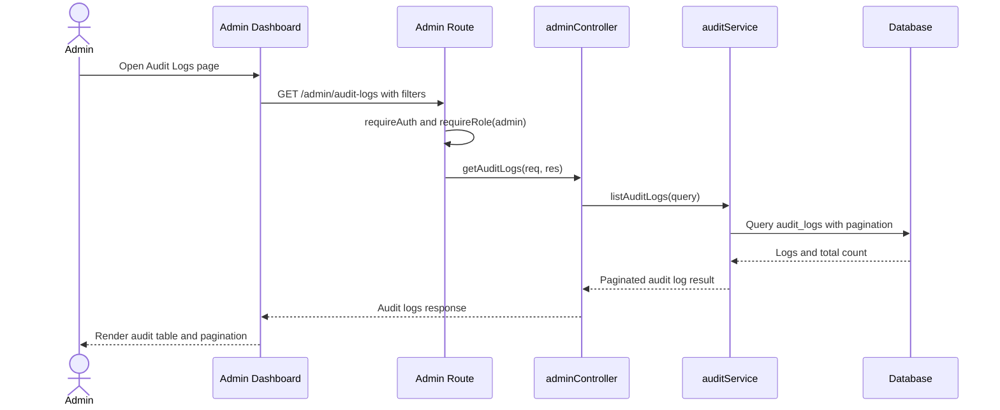

# Sequence Diagrams - MediConnect

This document contains focused Mermaid sequence diagrams for the main workflows in the Telehealth Consultation and Medical Record Management System. Each diagram follows the current route, controller, service, database, storage, and external integration structure.

## A. Login and JWT Authentication

**Figure 4.4 - Login and JWT Authentication Sequence Diagram**

This sequence diagram illustrates how the frontend authenticates a user through the Express backend. The backend verifies the password using bcrypt and returns a JWT token without exposing the password hash.

**Purpose:** Use this diagram in the security or authentication section to explain token-based login and protected API access.

## B. Patient Appointment Booking

**Figure 4.5 - Appointment Booking Sequence Diagram**

This sequence diagram shows how appointment booking is validated against doctor schedules, approved leave requests, existing locked appointments, and idempotency rules before a pending appointment is created.

**Purpose:** Use this diagram in the appointment scheduling chapter to explain booking correctness and duplicate-slot prevention.

## C. Medical Record Upload

**Figure 4.6 - Medical Record Upload Sequence Diagram**

This sequence diagram explains how patient medical files are uploaded through multipart form data, validated by middleware, stored through the storage adapter, and recorded in the database as document metadata.

**Purpose:** Use this diagram in the medical record management chapter to demonstrate upload security and storage abstraction.

## D. Symptom Chatbot Summary Save

**Figure 4.7 - Symptom Chatbot Summary Save Sequence Diagram**

This sequence diagram shows how the rule-based chatbot collects symptom answers, creates a structured summary, and saves the result to the backend. The chatbot does not diagnose or prescribe.

**Purpose:** Use this diagram in the chatbot or patient workflow chapter to clarify the safety boundary and data persistence flow.

## E. Doctor Consultation Note Creation

**Figure 4.8 - Doctor Consultation Note Creation Sequence Diagram**

This sequence diagram illustrates how a doctor writes a consultation note for an assigned appointment. The backend verifies ownership before storing the note and updating the appointment status.

**Purpose:** Use this diagram in the consultation workflow chapter to explain doctor-side clinical documentation and authorization.

## F. Lightweight Video Consultation with Jitsi

**Figure 4.9 - Lightweight Video Consultation Sequence Diagram**

This sequence diagram shows the MVP video consultation workflow. The application does not implement a custom WebRTC or signaling server; it provides controlled access to a deterministic Jitsi Meet room link for confirmed appointments.

**Purpose:** Use this diagram in the teleconsultation section to explain the lightweight video-call integration and its authorization rules.

## G. Admin Audit Log Review

**Figure 4.10 - Admin Audit Log Review Sequence Diagram**

This sequence diagram describes how administrators review audit logs through a protected admin API. The backend enforces admin-only access and returns paginated results to avoid loading excessive log data.

**Purpose:** Use this diagram in the security, administration, or traceability chapter to show how important system actions are monitored.
