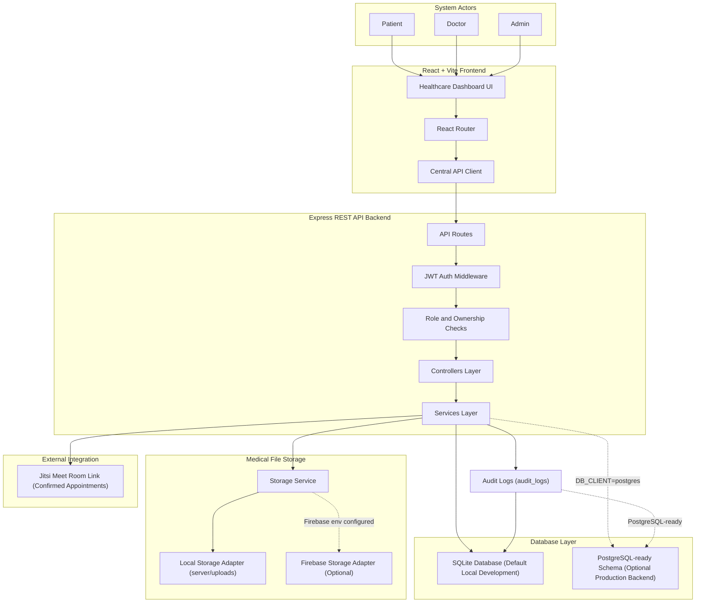

# System Architecture Diagram - MediConnect

This document provides a report-ready architecture diagram for the Telehealth Consultation and Medical Record Management System. The diagram is based on the current React frontend, Express backend, database schema, storage services, audit logging, and Jitsi Meet video-room integration.

## System Architecture

**Figure 4.1 - MediConnect System Architecture Diagram**

This architecture diagram illustrates how the three user roles interact with the React frontend, which communicates with the Express REST API through a centralized API client. The backend applies JWT authentication, role-based authorization, and ownership checks before delegating business logic to modular service classes. The system uses SQLite for local development while preserving PostgreSQL-ready schema support, and it abstracts medical document storage through local and Firebase-compatible adapters.

**Purpose:** This diagram should be used in the system design or architecture chapter to explain the overall structure, major components, and integration boundaries of the application.
