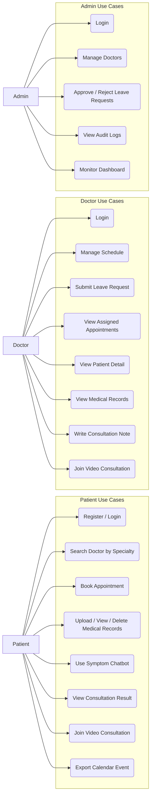

# Use Case Diagram - MediConnect

This document presents the main user-facing capabilities of the Telehealth Consultation and Medical Record Management System. Mermaid flowchart syntax is used to create a GitHub-compatible use case-style diagram.

## Use Case Overview

**Figure 4.2 - MediConnect Use Case Diagram**

This use case-style diagram summarizes the functional scope of the system for patients, doctors, and administrators. It shows how each actor accesses role-specific workflows such as appointment booking, schedule management, medical record handling, leave approval, video consultation, and audit log review.

**Purpose:** This diagram should be used in the requirements analysis chapter to communicate the expected interactions between system actors and the application.
